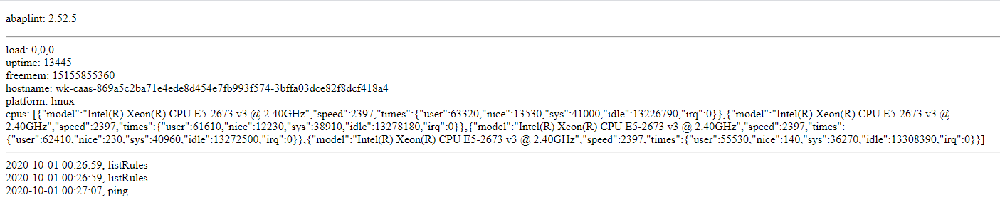

# abaplint SCI Server

This project enables [abaplint](https://abaplint.org) to be run in the context of SAP Code Inspector (SCI), allowing immediate feedback to the ABAP developers in their standard editor, SE24 / SE80 / SE38 / ABAP in Eclipse. And also works seamlessly with other places where the code inspector is triggered like ABAP Test Cockpit (ATC).

## Overview

The integration requires two parts: The abaplint Server (this project) and the [abaplint Client](https://github.com/abaplint/abaplint-sci-client). When performing code checks through one of the supported editors or transactions, the abaplint Client will collect the necessary objects and dependencies and send them to the abaplint Server to be processed. The server responds with all of the abaplint findings, which are displayed like any other check results in the SAP tools.

**Important:** The code under test leaves your ABAP system! Be sure to use a secure and controllable abaplint Server. For a test, you might use the common server at [http://sci.abaplint.org/](http://sci.abaplint.org/) (but please don't post any proprietary code).

## Deployment Options

The server is provided as a [NodeJs](https://nodejs.org) application and Docker image. It can therefore be deployed in several ways, for example:
- Using SAP Cloud Foundry
- Using Docker On-premise
- Using Azure Container Instance

### Deployment on Cloud Foundry

Get the **free** [SAP Cloud Foundry Trial](https://www.sap.com/cmp/td/sap-cloud-platform-trial.html).

- `cf login`
- `npm install`
- `npm test`
- `npm run build`
- `cf push`

### Deployment on Docker Image

A docker image is available on [Docker Hub](https://hub.docker.com/r/abaplint/abaplint-backend). See [Docker Deployment](./docs/docker.md) for details.

### Deployment on Azure Container Instance 

You can configure a Github action to automatically create an abaplint Server running in an [Azure Container Instance](./docs/azure.md).

## Server Health

### Ping

If you ping the FQDN of your abaplint Server, it should reply with message like:

`Server is OK, abaplint version = 2.52.5`

### Homepage

The homepage of your server will show the abaplint version, some details about the server environment, and a list of the most recent
abaplint API requests. 

## Development Notes

[Docker Development Notes](./docs/dev-notes.md)
