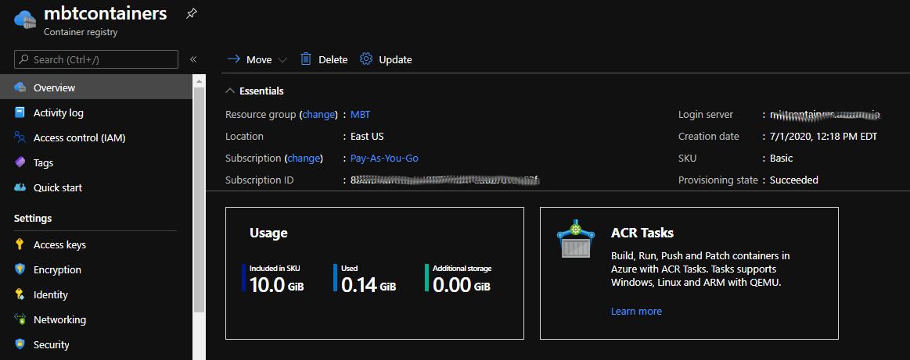
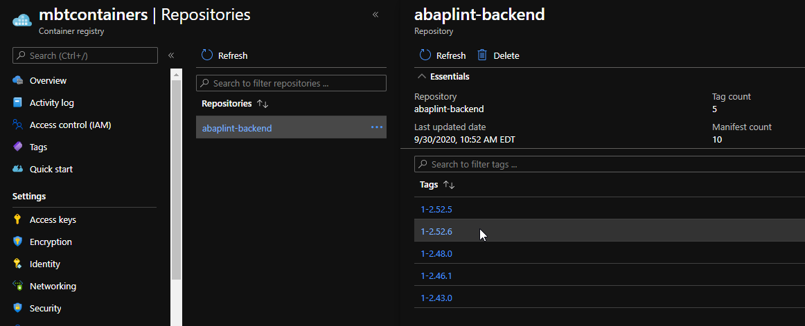
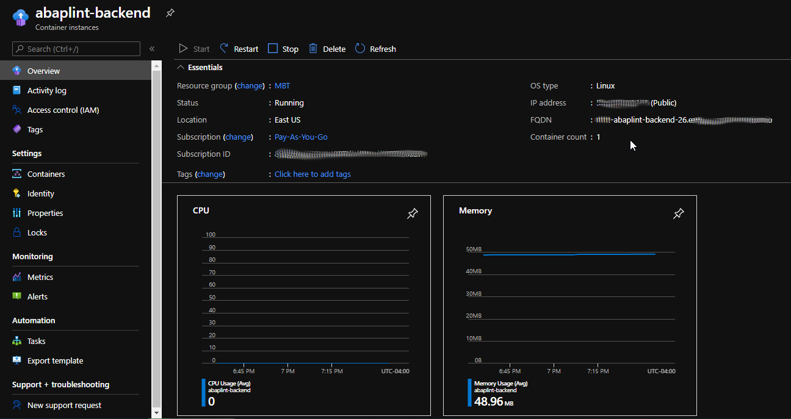
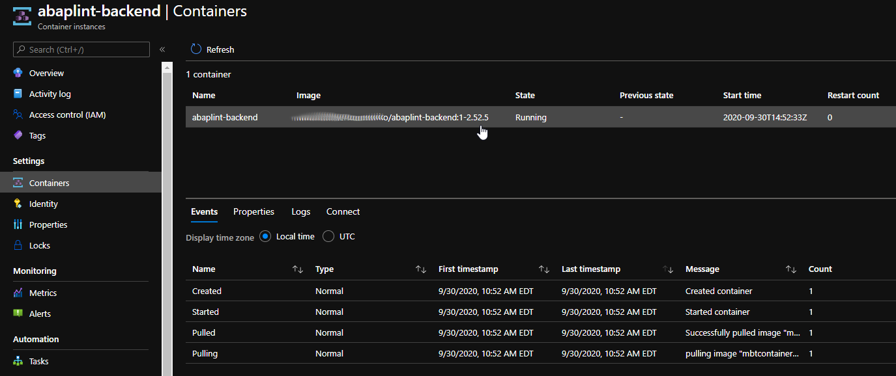
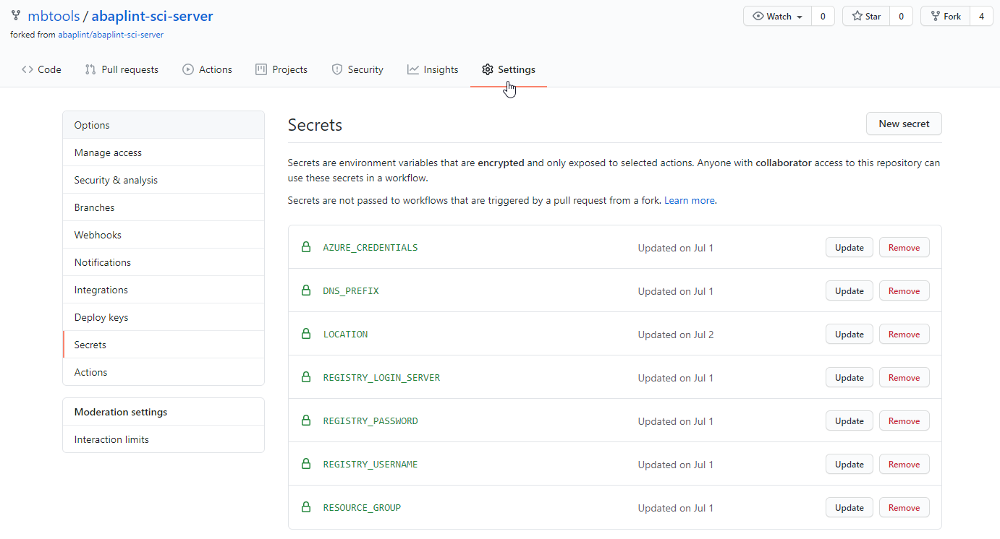
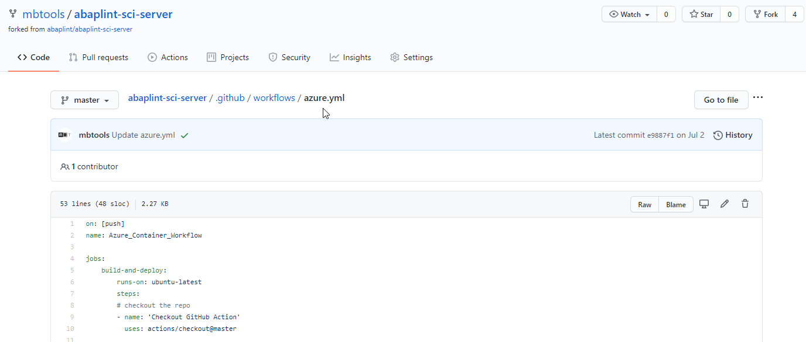

## Deployment on Azure Container Instance

The deployment of an abaplint server can be automated by using a Github action which will deploy the docker image on an Azure container instance.

### TL;DR

Fork this repo and add an action yaml file to your .github/workflow directory. Maintain the corresponding secrets for your repo. Perform a pull request on your 
repo to trigger the creation an abaplint server in your Azure container.

### Introduction

The general setup of Github actions deploying to Azure container instances is described 
[here](https://docs.microsoft.com/en-us/azure/container-instances/container-instances-github-action).

If you are not familiar with Azure containers, we recommend to follow the "hello world" example in the Microsoft documentation. 
If your "hello world" runs successfully, setting up abaplint server will be a piece of cake.

The abaplint server image requires about 0.02GB and easily fits into the Basic SKU for an Azure container which currently provides 10GB (see 
[Pricing](https://azure.microsoft.com/en-us/pricing/details/container-instances/)).

### Setup

1. Azure Container Registry

The registry holds your abaplint docker images. Each new deployment will be tagged with the abaplint version. Generally, you will need only the
latest version and can savely delete any older images. It makes sense to keep the last working one, of course, until you confirm that any
new deployment went ok.

2. Azure Container Instance

The instance is based on one of the images in your registry. You can start and stop the instance which takes only a few seconds. Note the FQDN
of your instance since this has to be entered into the abaplint client configuration.

3. Github Settings

In the settings of your repository, you maintain several secrets which contain the connection details to your Azure environment.

4. Github Action

In your repository (your fork), add a file to /.github/workflows for example called azure.yml. Copy the content of 
[azure.yml](https://github.com/mbtools/abaplint-sci-server/blob/master/.github/workflows/azure.yml) to it. You might have to
adjust the location according to you Azure location. The file can be public since all sensitive information is kept only in the secrets of your repository.

### Deployment

If there's a change (push) to your repository, Github will trigger the action and deploy the latest version to your Azure container instance. 
Note, that this will change the URL of the server. Remember to update your abaplint Client configuration accordingly.

